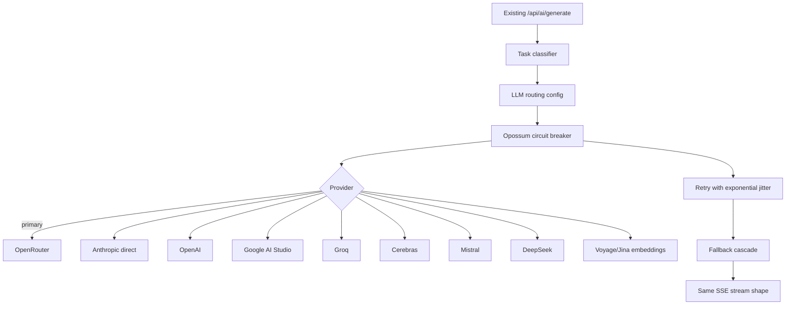
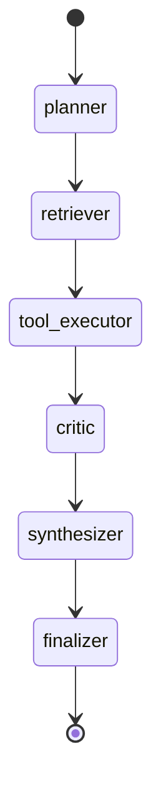
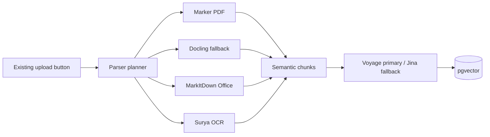
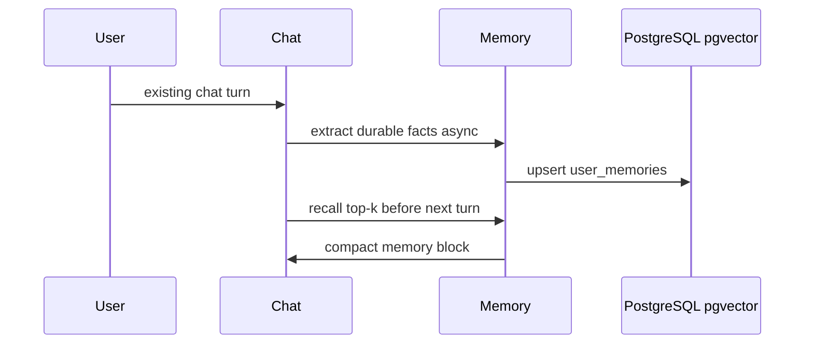
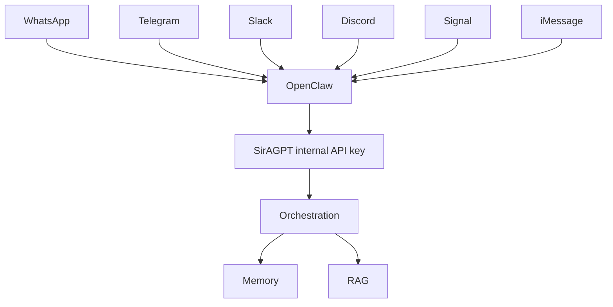
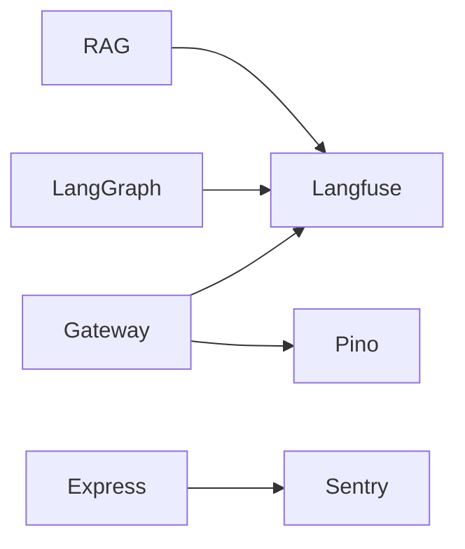

# Internal Architecture

SirAGPT keeps the web UI frozen. All upgrades in this branch live behind existing Express routes, SSE event names, JSON contracts, and status codes.

## Multi-LLM Gateway

Routing is configured in `backend/src/orchestration/llm-routing.config.js`. Provider failures are isolated with `opossum`, retry-after headers are respected, and provider choice is scored by quality, latency, and cost.

## LangGraph Checkpoints

Each node can persist state to `agent_checkpoints` with `thread_id`, `checkpoint_id`, `parent_checkpoint_id`, `state`, `metadata`, and `created_at`. The `state` column has a GIN index for operational inspection.

## RAG And Document Pipeline

The planner is internal and does not add UI toggles. Existing extraction remains the fallback when optional parser services are not installed.

## Memory Lifecycle

`backend/src/orchestration/memory-adapter.js` exposes a Mem0-compatible facade over the existing long-term memory and pgvector store.

## OpenClaw Multichannel

OpenClaw is optional and deployable via `infra/openclaw/docker-compose.yml`. The web application exposes no new visible routes.

## Observability

Langfuse and Sentry are sampled via environment variables and must never block request handling.
