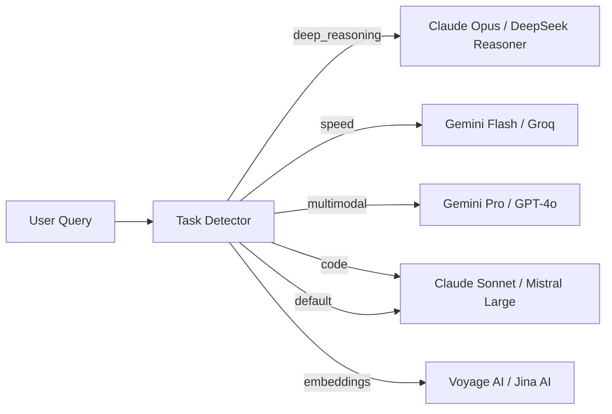
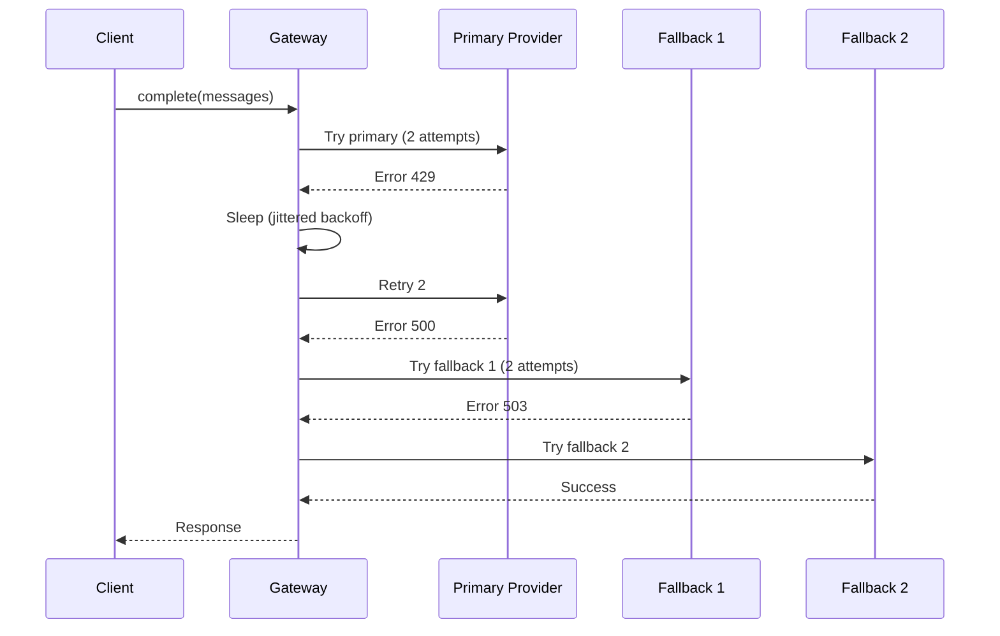
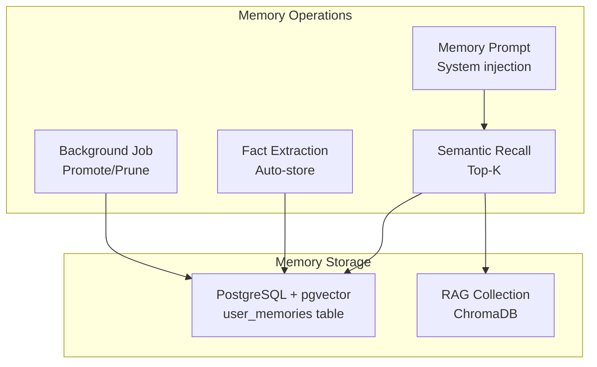
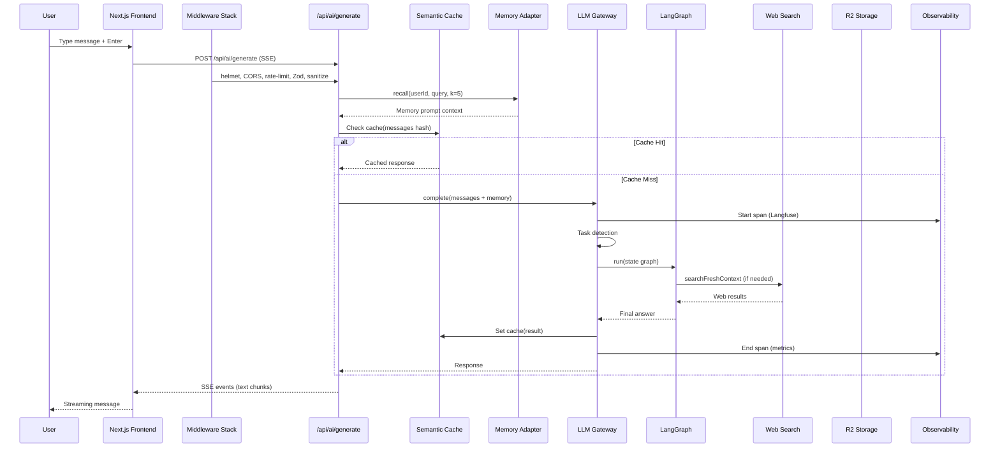
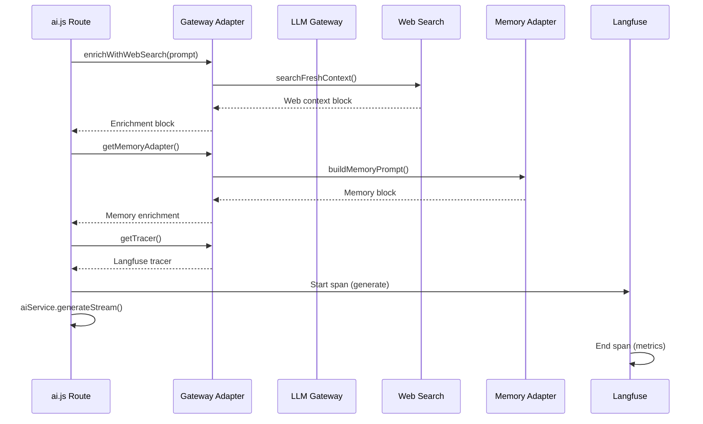

# Internal Architecture — SiraGPT Orchestration Layer

## Overview

SiraGPT uses a deep multi-layer backend orchestration that remains completely invisible to the UI. All LLM calls, memory retrieval, RAG pipelines, web searches, artifact storage, and multi-agent collaboration flow through a unified orchestration core at `backend/src/orchestration/`.

## Architecture Diagram

```mermaid
graph TB
    subgraph "Frontend (Zero Changes)"
        UI[Next.js App Router]
    end

    subgraph "Express API Layer"
        AI[POST /api/ai/generate]
        FILES[POST /api/files]
        SSE[SSE Stream Events]
    end

    subgraph "Orchestration Core"
        GW[LLM Gateway<br/>Multi-Provider]
        LG[LangGraph Engine<br/>State Graphs]
        MM[Memory Adapter<br/>pgvector + RAG]
        SC[Semantic Cache<br/>Upstash Redis]
        WS[Web Search Tools<br/>Tavily/Exa/Firecrawl/SearXNG]
        R2[Cloudflare R2<br/>Artifact Storage]
    end

    subgraph "Providers"
        OR[OpenRouter<br/>Primary LLM Proxy]
        AN[Anthropic<br/>Direct API]
        OA[OpenAI<br/>Direct API]
        GO[Google AI<br/>Paid API]
        GR[Groq Cloud<br/>Fast Inference]
        CE[Cerebras<br/>Fast Inference]
        MI[Mistral La Plateforme]
        DS[DeepSeek API]
        VO[Voyage AI<br/>Embeddings]
        JI[Jina AI<br/>Embeddings]
    end

    subgraph "Observability"
        LF[Langfuse<br/>Trace & Cost]
        HE[Helicone<br/>LLM Proxy]
        PN[Pino<br/>Structured Logs]
        SE[Sentry<br/>Error Tracking]
    end

    subgraph "Multi-Channel"
        OC[OpenClaw<br/>WhatsApp/Telegram/Slack/Discord/Signal/iMessage]
    end

    UI --> AI
    UI --> FILES
    UI --> SSE
    AI --> GW
    AI --> MM
    AI --> SC
    AI --> WS
    FILES --> R2
    GW --> OR
    GW --> AN
    GW --> OA
    GW --> GO
    GW --> GR
    GW --> CE
    GW --> MI
    GW --> DS
    GW --> VO
    GW --> JI
    GW --> LG
    MM --> LG
    LF -.-> GW
    HE -.-> GW
    PN -.-> GW
    OC --> AI
```



## LLM Gateway (`llm-gateway.js`)

### Multi-Provider Architecture

The gateway wraps 10 providers behind a unified `complete()` and `embed()` API:

| Provider | Models | Primary Use |
|----------|--------|------------|
| OpenRouter | claude-opus-4.7, claude-sonnet-4.6, claude-haiku-4.5 | General LLM via proxy |
| Anthropic | claude-opus-4-7, claude-sonnet-4-6, claude-haiku-4-5 | Direct Claude API |
| OpenAI | gpt-4o, gpt-4o-mini | Multimodal, general chat |
| Google AI | gemini-2.5-pro, gemini-2.5-flash | Multimodal, speed |
| Groq Cloud | llama-3.3-70b-versatile, deepseek-r1-distill | Ultra-fast inference |
| Cerebras | llama-3.3-70b | Speed-oriented |
| Mistral | mistral-large-latest, mistral-small-latest | Code, chat |
| DeepSeek | deepseek-reasoner, deepseek-chat | Deep reasoning, cost-effective |
| Voyage AI | voyage-3-large | Embeddings (primary) |
| Jina AI | jina-embeddings-v3 | Embeddings (fallback) |

### Circuit Breaker Pattern

Each provider-model pair gets its own `opossum` circuit breaker:
- **Error threshold**: 50% failure rate
- **Reset timeout**: 60 seconds
- **Rolling window**: 60 seconds
- **Per-call timeout**: 45 seconds (configurable via `SIRAGPT_LLM_GATEWAY_TIMEOUT_MS`)

### Rate Limit Detection

The gateway parses `x-ratelimit-*` headers and `Retry-After` headers from all providers. When rate-limited:
1. The exact `retryAfterMs` from headers is used (capped at 15s)
2. Otherwise, jittered exponential backoff: `min(10s, 300 * 2^(attempt-1) + random(250ms))`

### Task-Based Model Selection



### Cascade Fallback



## LangGraph Engine (`langgraph-engine.js`)

### State Graph Architecture

```
[START] → planner → retriever → tool-executor → critic → synthesizer → finalizer → [END]
                                                        ↑_____________|
                                                    (if needsRevision)
```

### Nodes

| Node | Responsibility |
|------|---------------|
| `planner` | Analyzes intent, creates execution plan with steps |
| `retriever` | Queries RAG + pgvector memory for relevant context |
| `tool-executor` | Executes tool calls (web search, code exec, file ops) |
| `critic` | Validates output quality, safety, correctness |
| `synthesizer` | Combines retrieved context + tool results → final answer |
| `finalizer` | Persists checkpoint, logs metrics, formats response |

### State Shape (Typed via LangGraph Annotations)

```typescript
interface OrchestrationState {
  messages: Message[];       // Accumulated via reducer
  plan: { steps: string[], intent: string };
  retrieval: Result[];       // RAG results
  toolResults: ToolResult[]; // Accumulated via reducer
  critique: { safe: boolean, needsRevision: boolean };
  answer: string | null;
  nodeHistory: string[];     // Accumulated via reducer
}
```

### Checkpoint Persistence

Every node execution persists state to PostgreSQL `agent_checkpoints` table:
- Rollback on failure: resumes from last successful checkpoint
- Thread isolation: `thread_id` + `checkpoint_id` compound key
- GIN index on `state` JSONB for fast queries

## Memory System (`memory-adapter.js`)

### Two-Tier Architecture



### Memory Lifecycle

1. **Automatic extraction**: Each user message is analyzed for facts
2. **pgvector upsert**: HNSW-indexed embeddings (1024-dim, voyage-3-large)
3. **Promotion**: Facts accessed 3+ times auto-promoted (importance × 1.2)
4. **Pruning**: Low-importance (0.2), zero-access, 7+ days stale → deleted
5. **System prompt injection**: Top-K relevant memories prepended to each turn

### Table Schema

```sql
CREATE EXTENSION IF NOT EXISTS vector;

CREATE TABLE user_memories (
  id UUID DEFAULT gen_random_uuid() PRIMARY KEY,
  user_id UUID NOT NULL,
  content TEXT NOT NULL,
  embedding vector(1024),
  category TEXT DEFAULT 'general',
  importance_score REAL DEFAULT 0.5,
  last_accessed_at TIMESTAMPTZ DEFAULT NOW(),
  access_count INT DEFAULT 0,
  created_at TIMESTAMPTZ DEFAULT NOW(),
  updated_at TIMESTAMPTZ DEFAULT NOW()
);

CREATE INDEX idx_user_memories_hnsw ON user_memories
  USING hnsw (embedding vector_cosine_ops);
```

## Semantic Cache (`semantic-cache.js`)

### How It Works

1. Normalize prompt → SHA-256 hash key
2. Check Upstash Redis for cached response
3. Cache hit → return instantly (30-60% latency reduction for repeated queries)
4. Cache miss → LLM call → store result with TTL

### Bypass Rules

Cache is skipped when:
- Query contains volatile terms (now, today, latest, price, weather, etc.)
- TTL is set to 0
- Stream mode is active
- `cacheBypass: true` in request

### TTL Configuration

| Task Type | Default TTL | Env Variable |
|-----------|------------|-------------|
| deep_reasoning | 7200s (2h) | `SIRAGPT_CACHE_TTL_DEEP_REASONING` |
| speed | 300s (5m) | `SIRAGPT_CACHE_TTL_SPEED` |
| multimodal | 1800s (30m) | `SIRAGPT_CACHE_TTL_MULTIMODAL` |
| code | 600s (10m) | `SIRAGPT_CACHE_TTL_CODE` |
| default | 3600s (1h) | `SIRAGPT_CACHE_TTL_DEFAULT_SECONDS` |

## Web Search Tools (`web-search-tools.js`)

### Provider Chain

```
Tavily (primary) → Exa (fallback 1) → Firecrawl (fallback 2) → SearXNG (fallback 3)
```

| Provider | API Key Required | Best For |
|----------|-----------------|----------|
| Tavily | TAVILY_API_KEY | General web search with AI summaries |
| Exa | EXA_API_KEY | Semantic academic search, neural embeddings |
| Firecrawl | FIRECRAWL_API_KEY | Deep page scraping, markdown extraction |
| SearXNG | None (self-hosted) | Metasearch, privacy, no API keys |

### Auto-Invocation

The LangGraph engine auto-invokes web search when:
- Query contains temporal keywords (today, latest, 2025-2029)
- Domain-specific freshness requirements (news, prices, weather)
- No cached RAG results match the query

## R2 Artifact Storage (`r2-storage.js`)

### Operations
- **PUT**: Upload artifacts (Word, Excel, PowerPoint, PDFs) → R2 bucket
- **GET Signed URL**: Generate presigned URLs (15-min default TTL) for download
- **DELETE**: Remove artifacts
- **PUT Signed URL**: Client-side direct upload to R2

### Key Structure
```
artifacts/{userId}/{timestamp}-{safeFileName}
```

## SSE Streaming (`sse-stream.js`)

### Features
- **Gzip compression**: Reduces bandwidth 5-10x for text-heavy streams
- **Backpressure handling**: `sendSafe()` awaits drain if writable buffer is full (5s max)
- **Batch writer**: Accumulates up to 16 events or 50ms for efficient writes
- **Heartbeat**: Every 15 seconds to keep connection alive
- **Last-Event-ID replay**: Reconnects resume from last received event
- **Max buffer**: 500 events in replay buffer

## Observability (`observability.js`)

### Langfuse Integration
- Every LLM call traced with span (model, provider, latency, tokens, cost)
- Every LangGraph node traced with state snapshots
- Trace-level scoring for quality feedback

### Helicone Proxy (Optional)
- Transparent LLM proxy adding observability headers
- Per-user property tagging
- Compatible with OpenAI and Anthropic

### Cost Estimation
Built-in cost calculator supporting all 10 providers with per-model input/output token pricing.

## Multi-Agent Teams (`multi-agent/team-router.js`)

### Thesis/Paper Team
```
thesis-writer → apa-reviewer → citation-verifier
```

### Code Team
```
planner → coder → reviewer
```

### Default Team
```
planner → critic → finalizer
```

## OpenClaw Multi-Channel (`multichannel/openclaw-adapter.js`)

### Supported Channels
- WhatsApp, Telegram, Slack, Discord, Signal, iMessage

### Architecture
```
External Channel → OpenClaw Gateway → SiraGPT Internal API
                                            ↓
                                    LLM Gateway + Memory + RAG
```

Users receive the same AI quality across chat apps without any UI changes to the web platform.

## Middleware Stack (in order)

1. **helmet** — Security headers (CSP, HSTS, X-Frame-Options, etc.)
2. **CORS** — Strict allowlist from `CORS_ORIGINS` env (comma-separated)
3. **request-id** — X-Request-Id generation and propagation
4. **pino-http** — Structured request/response logging
5. **compression** — Response body gzip/brotli
6. **rate-limit** — Upstash Redis-backed, per-IP + per-user
7. **Zod validation** — Schema validation on all endpoints
8. **XSS/Prompt injection** — Heuristic sanitization
9. **Auth** — JWT + session verification
10. **Error handler** — Centralized error formatting

## Data Flow: Complete Request Lifecycle



## UI Lock Contract

### Gateway Adapter (`gateway-adapter.js`)

The gateway-adapter bridges the existing Express routes (ai.js) with the new orchestration layer without modifying the SSE contract or JSON response shapes:



#### Key Injection Points in ai.js

1. **Import** (line 130): `require('../orchestration/gateway-adapter')`
2. **Web Search Enrichment** (line ~2810): Added before system instruction assembly
3. **Orchestration Memory** (line ~2820): Additional memory block from pgvector + RAG
4. **Langfuse Tracing** (line ~3240): Wraps the `aiService.generateStream()` call

All enrichments are best-effort (fail-open). If any orchestration service is unavailable, the request continues normally with existing behavior.

### Semantic Cache Integration

The gateway's `complete()` method checks the semantic cache before sending requests to providers:

```
1. Compute SHA-256(prompt + context + model + temperature)
2. Check Upstash Redis for cached response
3. Skip cache if: volatile query terms, streaming mode, TTL=0
4. On cache hit: return instantly (30-60% latency reduction)
5. On cache miss: proceed with LLM call, store result with TTL
```

## UI Lock Contract

**Absolute Rule**: No UI changes allowed. The frontend is frozen.

### Verification Methods
1. **Hash-based**: SHA-256 of every `.tsx` and `.css` file in `app/`, `components/`, `hooks/`, `lib/`, `styles/`
2. **CI enforcement**: `ui-lock-verify` job fails on any hash mismatch
3. **Visual regression**: Pixel-perfect Playwright snapshots of key routes (`/`, `/chat`, `/settings`, `/projects`)
4. **Verification script**: `scripts/verify-ui-lock.sh`

### Frozen Zones
- ✅ `app/` — All page routes and layouts
- ✅ `components/` — All React components
- ✅ `hooks/` — All custom hooks
- ✅ `lib/` — Context providers and utilities
- ✅ `styles/` — Global CSS files
- ✅ `tailwind.config.js` — Design system tokens
- ✅ `postcss.config.*` — CSS processing
- ✅ `next.config.*` — Build configuration
