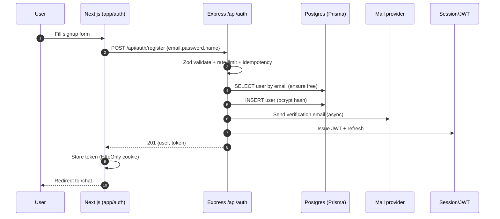

# siraGPT — System Architecture (Cycle 26)

This document is the canonical, top-level architecture reference for siraGPT. It
complements the deeper notes in `docs/architecture/ARCHITECTURE.md`,
`docs/architecture/PIPELINE.md`, and `docs/architecture/STATE_MACHINE.md`.

> Quick legend — Solid arrows are synchronous calls (HTTP / function), dashed
> arrows are async / queue / pub-sub, and dotted arrows are streaming channels
> (WebSocket, Server-Sent Events).

---

## 1. High-level diagram

```mermaid
flowchart LR
  subgraph Client
    BR[Browser / Next.js 14 App Router]
    MOB[iOS / Android Capacitor shell]
  end

  subgraph Frontend["Frontend (Next.js 14)"]
    APP[app/* App Router]
    Z[Zustand + Context stores<br/>chat / artifact / cowork / auth]
    UI[shadcn/ui + Tailwind]
    SDK[/lib/api.ts /]
  end

  subgraph Backend["Express backend (backend/src)"]
    MW[Security / Auth / Idempotency<br/>middleware]
    ROUTES[40+ route modules<br/>backend/src/routes/*]
    AI[ai-service / ai.js]
    AGENT[agent-core / agent-task-runner /<br/>agent-task-queue]
    SIRA[Cortex + Document pipeline<br/>backend/src/services/sira/*]
    COWORK[cowork-engine /<br/>cowork-progress-stream]
    SKILLS[skills-registry +<br/>session-manager]
    OBS[observability/* (OTel + Pino)]
  end

  subgraph Infra
    PG[(PostgreSQL 16 — Prisma)]
    REDIS[(Redis — BullMQ + cache)]
    Q[[BullMQ workers]]
    WS[[Socket.IO / WS gateway]]
    S3[(Object storage / uploads/)]
  end

  subgraph Providers["AI providers (provider-registry)"]
    OAI[OpenAI]
    ANT[Anthropic]
    GEM[Google Gemini]
    GRQ[Groq / Mistral / xAI / DeepSeek]
    EL[ElevenLabs]
    FIG[Figma / Canva]
  end

  BR --> APP
  MOB --> APP
  APP --> Z
  APP --> UI
  APP --> SDK
  SDK -->|HTTPS JSON| MW
  MW --> ROUTES
  ROUTES --> AI
  ROUTES --> AGENT
  ROUTES --> SIRA
  ROUTES --> COWORK
  ROUTES --> SKILLS
  ROUTES --> PG
  AI --> Providers
  AGENT -. enqueues .-> Q
  Q --> REDIS
  Q --> AI
  COWORK -. progress .-> WS
  AGENT -. events .-> WS
  WS -.streams.-> BR
  AI --> OBS
  AGENT --> OBS
  SIRA --> PG
  ROUTES --> S3
```

---

## 2. Frontend

- **Framework:** Next.js 14, App Router (`app/`), React Server Components where
  applicable.
- **State management:** Zustand stores + React Context. Notable stores:
  `lib/chat-context-integrated.tsx`, `lib/artifact-panel-context.tsx`,
  `lib/auth-context.tsx`, `lib/background-streams-context.tsx`,
  `lib/code-workspace-context.tsx`.
- **UI kit:** shadcn/ui (`components/ui/*`) + Tailwind CSS, theme tokens in
  `styles/`.
- **Network layer:** `lib/api.ts` + typed contracts in `lib/api-types.ts` (the
  SDK in `packages/sdk` reuses these types).
- **Mobile shell:** Capacitor (`capacitor.config.ts`, `ios/`, `android/`) reuses
  the same web bundle via `mobile-www/`.
- **Observability on the client:** PostHog + Sentry (`@sentry/nextjs`).

## 3. Backend

- **Runtime / framework:** Node.js ≥ 22, Express.js (`backend/src/index.js`).
- **ORM / DB:** Prisma against PostgreSQL 16.
- **Queue:** BullMQ on Redis. Workers live under
  `backend/src/services/agents/agent-task-queue.js` and
  `agent-task-worker.js`.
- **Auth:** Passport.js (JWT, Google OAuth, WebAuthn) plus agent API keys
  (`/api/agent/keys`).
- **Validation:** Zod schemas in `backend/src/schemas/` — single source of truth
  feeding both `generate-api-types.js` and `generate-openapi.js`.
- **Reliability utilities:** `async-guard`, `fetch-instrument`,
  `circuit-breaker`, `bulkhead`, `runAnalyzerSafe`.

### 3.1 Request lifecycle

```
HTTP → security/cors/helmet → rate-limit → idempotency
     → parsing (compression, json, cookies)
     → observability (pino + request-id + OTel span)
     → auth (JWT/Passport/agent-key/admin)
     → route handler (backend/src/routes/*)
     → service layer (sira/, agents/, cowork-*)
     → Prisma / Redis / providers
     → error handler (JSON envelope)
```

## 4. AI providers and routing

- Provider catalog: `backend/src/services/agents/provider-registry.js` +
  `backend/src/services/providers/*`.
- Model orchestration: `backend/src/services/ai-service.js` and the
  Express-facing route module `backend/src/routes/ai.js`.
- Per-provider adapters under `backend/src/services/agents/providers/`
  (OpenAI, Anthropic, Gemini, Groq, Mistral, xAI, DeepSeek, ElevenLabs).
- Smart routing rules:
  - **Capability match** — prefer providers that satisfy the requested modality
    (vision, audio, embeddings, tools).
  - **Health / circuit-breaker state** — `circuit-breaker.js` short-circuits a
    failing provider for the rolling window.
  - **Cost + plan budget** — `budget.js` enforces per-plan caps.
  - **Latency** — `adaptive-retry-strategy.js` + `best-of-n.js` allow racing
    two providers when latency budgets are tight.

## 5. Document pipeline registry

- Source of truth:
  `backend/src/services/sira/document-pipeline-registry.js`.
- Declarative registry with 20+ parsers/generators
  (`docx`, `pdf`, `pptx`, `xlsx`, `csv`, `md`, `html`, `tex`, …).
- Each entry exposes: `id`, `kind` (parser | generator | analyzer), `mime`,
  `extensions`, `handler`, `contentQualityScore`, `formatAdvice`.
- Analyzers are wired via `runAnalyzerSafe` for per-block isolation, telemetry,
  circuit breaker and deadlines. Health is exposed at
  `/api/admin/analyzer/health`.
- The `document-*` analyzer family follows the *lazy require + `buildXBlock` +
  ai.js wiring* pattern with PII / secret masking.

## 6. Cowork system

The cowork engine is the multi-step "AI workspace" that pairs the agent with
file storage, memory and skills.

| Capability      | Module                                                   |
|-----------------|----------------------------------------------------------|
| Auto-file       | `backend/src/services/auto-file-bridge.js`               |
| Deep analyzer   | `backend/src/services/sira/document-pipeline-registry.js` + `runAnalyzerSafe` |
| Active memory   | `backend/src/services/active-memory.js`                  |
| Sessions        | `backend/src/services/session-manager.js`                |
| Skills          | `backend/src/services/skills-registry.js` + `backend/src/skills/*` |
| Engine          | `backend/src/services/cowork-engine.js`                  |
| Progress stream | `backend/src/services/cowork-progress-stream.js`         |
| Health          | `backend/src/services/cowork-health.js`                  |
| HTTP surface    | `backend/src/routes/cowork.js`                           |

## 7. Observability stack

- Structured logging: **Pino** (JSON) with request-id correlation.
- Tracing: **OpenTelemetry** spans on inbound HTTP, outbound `fetch`
  (`fetch-instrument.js`), Prisma, BullMQ jobs and AI calls.
- Metrics: Prometheus rules in `docs/prometheus-rules.yml`. Custom counters in
  `backend/src/services/observability/*`.
- Error tracking: Sentry on both frontend (`@sentry/nextjs`) and backend.
- Health endpoints: `/api/admin/health/services`,
  `/api/admin/analyzer/health`, `/api/admin/queues/status`.
- Audit log: `backend/src/services/agents/audit-log.js` +
  `observability/provider-audit-log.js`.

## 8. Real-time channels

| Channel              | Transport       | Producer                          | Consumer (UI)                       |
|----------------------|-----------------|-----------------------------------|-------------------------------------|
| Chat streaming       | SSE             | `routes/ai.js`                    | `lib/chat-context-integrated.tsx`   |
| Agent task progress  | WebSocket (WS)  | `agent-task-runner` → `agent-events.js` | `lib/background-streams-context.tsx` |
| Cowork progress      | SSE             | `cowork-progress-stream.js`       | Cowork panel components             |
| Artifact updates     | WebSocket       | `artifact-engine.js`              | `lib/artifact-panel-context.tsx`    |
| Admin live metrics   | WebSocket       | `routes/admin.js`                 | Admin dashboard                     |

## 9. Auth flow

- Primary: e-mail + password (Passport local + bcrypt) → JWT.
- Federated: Google OAuth (`passport-google-oauth20`).
- Passwordless: WebAuthn (passkeys).
- Service-to-service: **agent API keys** (`/api/agent/keys`) with pairing codes.
- Tokens are stored in HttpOnly cookies and mirrored as `Authorization: Bearer`
  for SDK clients.

---

## 10. Sequence — user signup



## 11. Sequence — document upload + analysis

```mermaid
sequenceDiagram
  autonumber
  participant U as User
  participant FE as Frontend
  participant API as /api/files + /api/doc
  participant REG as document-pipeline-registry
  participant ANA as runAnalyzerSafe
  participant AI as ai-service
  participant DB as Postgres
  participant WS as Cowork progress SSE
  U->>FE: Drop file
  FE->>API: POST /api/files (multipart)
  API->>DB: Insert FileMetadata (status=uploaded)
  API-->>FE: 201 {fileId}
  FE->>API: POST /api/doc/analyze {fileId}
  API->>REG: resolve parser by MIME/ext
  REG->>ANA: parse(file) — guarded
  ANA->>ANA: PII / secret masking
  ANA->>AI: buildXBlock + analyzer block prompts
  AI-->>ANA: structured findings
  ANA->>DB: Persist analysis + contentQualityScore
  ANA-.progress.->WS
  WS-.->FE: stream blocks live
  ANA-->>API: { summary, blocks, advice }
  API-->>FE: 200 analysis result
```

## 12. Sequence — AI generation with RAG

```mermaid
sequenceDiagram
  autonumber
  participant U as User
  participant FE as Frontend
  participant API as /api/ai (Express)
  participant ROUTER as ai-service router
  participant RAG as hybrid-retrieval (sira)
  participant VEC as Vector store
  participant LLM as Provider (OpenAI/Anthropic/…)
  participant OBS as OTel + audit
  U->>FE: Send prompt (chatId)
  FE->>API: POST /api/ai/chat {messages, chatId}
  API->>API: auth + plan budget check
  API->>RAG: retrieve(query, chatId, userId)
  RAG->>VEC: hybrid search (BM25 + dense)
  VEC-->>RAG: top-k chunks + scores
  RAG-->>API: context + citations
  API->>ROUTER: route(model, capabilities)
  ROUTER->>LLM: stream completion (with context)
  LLM-.SSE.->ROUTER
  ROUTER-.SSE.->FE
  ROUTER->>OBS: span(model, tokens, latency)
  ROUTER->>API: final message + usage
  API->>API: persist assistant message + citations
  API-->>FE: stream end + final payload
```
