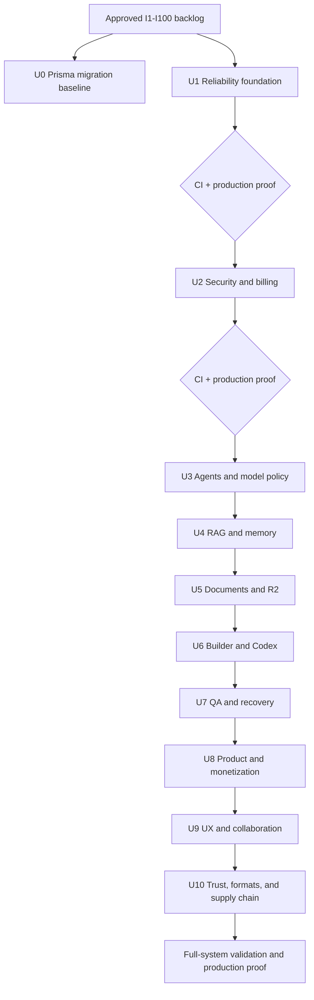

# feat: Deliver the 100-item SiraGPT improvement program

## Summary

Deliver the approved 100 improvements as ten independently releasable product units plus one migration-baseline prerequisite. Each unit must preserve backward compatibility, add focused tests, pass the full quality gates, and reach production before dependent work continues.

---

## Problem Frame

SiraGPT already contains many strong but partially connected services. The approved backlog spans reliability, authorization, agents, RAG, document editing, Codex, operations, billing, UI, and governance. Landing all changes in one diff would hide regressions and make rollback unsafe, so this plan treats the backlog as one program with ten atomic release boundaries.

---

## Approved Backlog Contract

The `Ideas` field in U1-U10 is the canonical I1-I100 backlog approved in the conversation. IDs are continuous, unique, and stable; no additional CAPTCHA item or other unapproved feature is implied by credential-gating notes. Any semantic change to an idea must be reviewed as a plan revision rather than silently substituted during implementation.

---

## Requirements

### Delivery and traceability

- R1. Every approved improvement I1-I100 must map to exactly one implementation unit.
- R2. Each behavior-bearing improvement must add or update focused automated tests.
- R3. Each unit must be independently deployable and must leave CI and production health green.
- R4. Production verification must compare the deployed full commit SHA with `/api/version`.
- R5. Progress is derived from commits and deployed SHAs; the plan remains a decision artifact.

### Safety and compatibility

- R6. Existing public APIs remain backward compatible unless a versioned replacement is shipped.
- R7. Database changes are additive, migration-safe, and covered by rollback-aware tests.
- R8. Security-sensitive changes fail closed without creating lockout paths for existing valid users.
- R9. External integrations remain disabled until their required credentials and readiness probes pass.
- R10. Generated documents and source-preserving edits retain the original binary as an immutable version.

### Product and agent parity

- R11. High-value product actions exposed in UI must have corresponding agent/tool or API access where appropriate.
- R12. The user's “proceed with everything” authorizes the UI items previously marked as requiring explicit UI approval.
- R13. UI work follows existing design-system, accessibility, responsiveness, and localization conventions.
- R14. Model, quota, and tool capability decisions use a single coherent policy path.
- R15. New telemetry avoids secrets, raw document content, and unbounded label cardinality.
- R16. Production is baselined for Prisma Migrate before any unit that changes the schema is released.

---

## Key Technical Decisions

- KTD1. **Release-train execution:** implement U1-U10 as separate reviewed release boundaries so a failed unit can be reverted without discarding unrelated improvements.
- KTD2. **Test-first behavior changes:** add a failing contract or characterization test before changing runtime behavior.
- KTD3. **Extend existing services:** wire and harden existing modules before introducing replacements.
- KTD4. **Feature-gated external services:** AWS, R2, WORM storage, CAPTCHA, push, and alternative embedding providers remain configuration-gated.
- KTD5. **Progressive data cutovers:** pgvector, unified memory, RBAC, and session-token migrations use dual-read or shadow verification before enforcement.
- KTD6. **Production proof per unit:** merge only after CI, then deploy the exact green `production-main` SHA and verify critical health.
- KTD7. **Advisory Prisma pool scaling:** apply static pool parameters at client creation and expose autoscaler recommendations; never replace the live shared Prisma client in-process.

---

## High-Level Technical Design

Each unit repeats the same lifecycle: focused red/green tests, implementation, local gates, independent review, branch CI, `production-main` CI, exact-SHA deploy, and production smoke verification.

---

## Implementation Units

### U0. Baseline production for Prisma Migrate

- **Goal:** Make the repository migration history authoritative in production before schema-bearing units ship.
- **Requirements:** R3-R7, R16.
- **Dependencies:** None.
- **Files:** `backend/prisma/migrations/`, `.github/workflows/deploy.yml`, `.github/workflows/ci.yml`, `scripts/check-migration-safety.js`, `backend/src/services/observability/health-check.js`, `backend/tests/db-migration-baseline.test.js`, `backend/tests/db-migration-production-path.test.js`.
- **Approach:** Inventory the live schema against `schema.prisma`, identify the first migration already represented in production, and use Prisma's supported baseline resolution without replaying historical DDL. Remove the broad P3005 continuation only after a disposable production-shaped database proves `migrate deploy` succeeds from the baseline.
- **Patterns to follow:** exact-SHA deploy pre-checks, additive migration safety markers, and the existing P3009 readiness probe.
- **Test scenarios:** an empty database applies every migration; a production-shaped unbaselined database is resolved without DDL replay; a divergent schema blocks release; P3005 is no longer silently accepted after cutover; a failed migration makes readiness unhealthy.
- **Verification:** CI and deploy use the same `prisma migrate deploy` path, production reports zero pending/failed migrations, and rollback documentation names schema compatibility constraints.

### U1. Reliability, metrics, readiness, and queues

- **Goal:** Make process lifecycle, metrics, health, database pools, and queue state operationally trustworthy.
- **Requirements:** R2, R3, R4, R6, R15.
- **Dependencies:** None.
- **Ideas:** I1 write-behind shutdown flush; I2 unified Prometheus registry; I3 metric-aligned alerts; I4 BullMQ readiness; I5 DB probe timeout; I6 scheduled probes; I7 Prisma pool parameters; I8 pool autoscaler; I9 complete admin queue registry; I10 queue backlog alerts.
- **Files:** `backend/index.js`, `backend/src/middleware/auth.js`, `backend/src/routes/metrics.js`, `backend/src/routes/se-agents.js`, `backend/src/routes/health-routes.js`, `backend/src/health/mount.js`, `backend/src/health/probe-scheduler.js`, `backend/src/services/observability/health-check.js`, `backend/src/services/observability/metrics-exposition.js`, `backend/src/services/queues/queue-registry.js`, `backend/src/utils/metrics.js`, `backend/src/services/agents/metrics.js`, `backend/src/services/write-behind-cache.js`, `backend/src/config/database.js`, `backend/src/db/pool-instrumentation.js`, `backend/src/db/pool-autoscaler.js`, `backend/src/routes/admin-queues.js`, `backend/src/utils/shutdown.js`, `backend/src/services/agents/agent-task-queue.js`, `backend/src/services/chat-run-queue.js`, `backend/src/services/codex/run-queue.js`, `backend/src/services/document-collection-queue.js`, `backend/src/services/goal-queue.js`, `docs/prometheus-rules.yml`, `backend/tests/metrics-exposition.test.js`, `backend/tests/health-route-queues.test.js`, `backend/tests/health-mount.test.js`, `backend/tests/probe-scheduler.test.js`, `backend/tests/database-pool-config.test.js`, `backend/tests/db-pool-autoscaler.test.js`, `backend/tests/admin-queues.test.js`, `backend/tests/write-behind-cache.test.js`, `backend/tests/prometheus-rules-contract.test.js`.
- **Approach:** Keep `/metrics` as the canonical scrape path and make `/internal/metrics` plus `/api/se-agents/metrics` compatibility aliases of the same renderer and guard. Authorize only the socket peer when it is loopback; otherwise accept a constant-time `METRICS_TOKEN` or authenticated super-admin. Compose utility, agent, process, cognitive, and fallback exporters while rejecting duplicate metric family names. Keep the current external `/health` contract on `services/observability/health-check.js`; mount the existing `health/` scheduler only under `/internal/health/*` for history and SLO aggregation. Move lazy queue ownership into a shared registry consumed by both stacks and admin routes; each queue declares criticality. Apply `connection_limit` and `pool_timeout` to the Prisma datasource URL before client creation. Reuse `db/pool-instrumentation.js`, run the autoscaler in recommendation mode, and export its target instead of replacing the live Prisma client. The shutdown hook calls an auth-owned flush function that never instantiates an unused cache.
- **Patterns to follow:** `backend/src/health/probes/`, `backend/src/utils/graceful-shutdown.js`, `backend/tests/sira-health-and-metrics.test.js`.
- **Test scenarios:** shutdown flushes the already-created auth write-behind singleton once and does not create one during shutdown; socket-loopback access succeeds while spoofed proxy headers do not; metrics token comparison rejects incorrect tokens and every compatibility alias returns the same exposition; duplicate metric family names fail the composition test; internal probe history populates without changing external health JSON; all five queue getters stay lazy without Redis; critical and non-critical queue failures produce the configured HTTP outcome; DB probe resolves to unhealthy within its timeout; datasource URLs preserve existing query parameters while applying validated pool limits; autoscaler recommendations respect min/max bounds without mutating Prisma; admin lists every configured queue; Prometheus rules parse and reference emitted family names, labels, and documented backlog thresholds.
- **Verification:** Existing health aliases remain compatible, production readiness remains 200 with healthy dependencies, and Prometheus rules reference emitted series.

### U2. Authorization, payments, sessions, and abuse controls

- **Goal:** Complete least-privilege authorization and close payment, session, CSRF, OAuth, and MCP gaps.
- **Requirements:** R2, R3, R6-R9, R15.
- **Dependencies:** U0 migration baseline; U1 telemetry and health proof.
- **Ideas:** I11 RBAC enforcement; I12 admin permission migration; I13 dev-admin bypass removal; I14 Stripe event idempotency; I15 fail-closed sensitive rate limits; I16 CSRF expansion; I17 hashed sessions; I18 distributed OAuth state; I19 distributed impersonation limit; I20 MCP HTTPS and allowlists.
- **Files:** `backend/src/middleware/require-permission.js`, `backend/src/routes/admin.js`, `backend/src/routes/payments.js`, `backend/src/middleware/rate-limit-auth.js`, `backend/src/middleware/csrf.js`, `backend/src/services/oauth-state.js`, `backend/src/services/agent-harness/mcp-client.js`, `backend/prisma/schema.prisma`, migrations, and security tests.
- **Approach:** Use observe-only telemetry before RBAC enforcement, persist webhook event IDs transactionally, support legacy sessions during hash migration, and require distributed stores only on sensitive paths.
- **Patterns to follow:** existing permission matrices, webhook idempotency middleware, WebAuthn Redis challenge store, and SSRF guards.
- **Test scenarios:** legacy authorized users retain access; unauthorized roles fail; repeated Stripe events cause one effect; Redis errors fail closed on login/billing; cookie-auth writes require CSRF; session lookup accepts transitional records; OAuth replay fails across instances; MCP rejects HTTP/private destinations.
- **Verification:** Security suites, SQL migration checks, billing tests, and auth integration tests pass without weakening existing assertions.

### U3. Agent routing, models, tools, and faithfulness

- **Goal:** Make the agent loop choose models and tools coherently and verify claims against actual tool evidence.
- **Requirements:** R2-R4, R6, R11, R14-R15.
- **Dependencies:** U1 metrics; U2 authorization boundaries.
- **Ideas:** I21 agentic cognitive rerouting; I22 adaptive prompted-step budget; I23 tool deferral; I24 vision-capable agent loop; I25 real self-consistency; I26 unified model/quota policy; I27 per-user capability overrides; I28 ambiguity flagger; I29 tool-result faithfulness; I30 executable skill alignment.
- **Files:** `backend/src/services/agentic-chat-stream.js`, `backend/src/routes/ai.js`, `backend/src/services/reasoning-orchestrator.js`, `backend/src/services/agents/tool-selector.js`, `backend/src/services/agent-harness/model-capabilities.js`, `backend/src/services/model-quota-router.js`, attribution services, skill registries, and agent tests.
- **Approach:** Introduce a single turn policy object consumed by routing, quotas, capability resolution, and tool selection. Roll out rerouting and deferred tools behind telemetry before making them default.
- **Patterns to follow:** prompted-tool fallback ladder, capability registry, chat faithfulness gate, and task tool manifests.
- **Test scenarios:** complex turns escalate only to eligible models; prompted loops receive sufficient steps; irrelevant tools stay deferred; vision turns retain tools; self-consistency aggregates deterministically; ambiguous turns clarify; unsupported claims are repaired; recommended skills are executable.
- **Verification:** Agent-first, prompted/native tool-call, quota, attribution, and provider failover suites pass.

### U4. RAG, memory, and research

- **Goal:** Make retrieval and memory durable, selective, provider-resilient, and self-improving.
- **Requirements:** R2-R4, R6-R7, R9, R14-R15.
- **Dependencies:** U0 migration baseline; U3 turn policy.
- **Ideas:** I31 selective RAG; I32 document-intent source gate; I33 pgvector cutover; I34 multi-provider embeddings; I35 Self-RAG for factual attachments; I36 conversation-aware chunk TTL; I37 unified memory; I38 consolidation job; I39 attribution feedback learning; I40 Research Agent tool.
- **Files:** `backend/src/services/rag-service.js`, `backend/src/services/rag-store.js`, `backend/src/services/document-intent-rag-gate.js`, memory services, `backend/src/services/research-agent.js`, `backend/src/services/agents/agent-tools.js`, schema/migrations, and RAG/memory tests.
- **Approach:** Add shadow comparison for pgvector and unified recall, preserve local fallbacks, and make embedding providers policy-driven. Use bounded feedback updates with rollbackable weights.
- **Patterns to follow:** user-memory store adapters, scientific search provider fan-out, and existing self-RAG contracts.
- **Test scenarios:** non-retrieval turns skip RAG; batch documents filter by intent; shadow stores return equivalent top hits; provider failover preserves dimensions; factual attachment Q&A invokes Self-RAG; active conversations retain chunks; consolidation is idempotent; research emits stable SSE.
- **Verification:** Retrieval quality evaluations do not regress and multi-instance durability tests pass.

### U5. Documents, R2, and source-preserving editing

- **Goal:** Make uploads durable and efficient while extending surgical document editing without regeneration.
- **Requirements:** R2-R4, R7, R9-R10, R15.
- **Dependencies:** U0 migration baseline; U1 health probes; U2 upload authorization and abuse controls; U4 retrieval storage.
- **Ideas:** I41 content-hash dedup; I42 production R2 gate; I43 direct presigned uploads; I44 confirmed artifact mirror; I45 unified PPTX design system; I46 PPTX visual insertion; I47 version restore API; I48 DOCX header/footer editing; I49 XLSX chart/pivot source updates; I50 unified editor routing.
- **Files:** `backend/src/routes/files.js`, `backend/src/services/object-storage.js`, R2 bridges, `backend/src/services/source-preserving-document-edit.js`, document adapters, Prisma schema/migrations, and document tests.
- **Approach:** Add full-file hashing and idempotent persistence, expose presigned upload sessions with completion validation, and keep original binaries immutable. Route all edits through one capability matrix.
- **Patterns to follow:** current `r2:` materialization, atomic artifact saves, `FileVersion`, and OOXML package validators.
- **Test scenarios:** duplicate uploads reuse storage/indexing; incomplete direct upload cannot create a File; R2 failure retains local source; visual PPTX edit preserves unrelated slides; restore creates a new version; headers/footers retain relationships; XLSX charts open after range changes; weak models cannot regenerate edit requests.
- **Verification:** DOCX/PPTX/XLSX/PDF package validation and R2/local fallback tests pass.

### U6. Builder, Codex, and application deployment

- **Goal:** Make generated applications iterative, repository-aware, verifiable, persistent, and publishable.
- **Requirements:** R2-R4, R6-R7, R9, R11, R13-R15.
- **Dependencies:** U0 migration baseline; U2 access control; U3 agents; U5 artifact storage.
- **Ideas:** I51 default runtime verification; I52 plan refinement API; I53 GitHub import; I54 local queue fallback; I55 Agent SDK subagent path; I56 real AWS executor; I57 persisted Builder sessions; I58 mobile/desktop codegen; I59 Codex-to-Deployments bridge; I60 deduplicated verification.
- **Files:** `backend/src/services/codex/`, `backend/src/services/builder/`, deployment services, `backend/src/routes/codex.js`, `backend/src/routes/builder.js`, Prisma schema/migrations, Codex UI/API clients, and tests.
- **Approach:** Unify on Codex Agent SDK, persist project/run linkage, and model publish as an explicit checkpoint-derived deployment. External cloud executors remain credential-gated.
- **Patterns to follow:** Codex checkpoints, Hostinger/node-container executors, runner client, and Builder deterministic fallbacks.
- **Test scenarios:** runtime failure blocks close; plan feedback revises prior plan; imported repo remains scoped; no-Redis local run completes; obsolete subagent path is unused; AWS dry-run produces auditable plan; sessions resume; mobile/desktop projects boot; export publishes exact checkpoint; verification runs once per state.
- **Verification:** Codex golden replay, runner integration, Builder contracts, and deployment service tests pass.

### U7. QA, backups, shutdown, and recovery

- **Goal:** Detect runtime regressions before release and prove recovery paths continuously.
- **Requirements:** R2-R5, R7, R9, R15.
- **Dependencies:** U1 operations; U6 runtime verification.
- **Ideas:** I61 browser-error auto-repair; I62 lint/tests at build close; I63 runner pool exhaustion UX; I64 BullMQ-safe Redis eviction; I65 durable webhook DLQ; I66 chaos tests in CI; I67 readiness CI smoke; I68 backup omission alert; I69 restore drill; I70 real inflight drain.
- **Files:** Codex verification modules, runner scripts, Redis compose config, webhook dispatcher, chaos tests, CI workflows, backup scripts/workflows, shutdown utilities, and affected UI.
- **Approach:** Add deterministic CI lanes for chaos and restore validation, keep expensive drills scheduled, and instrument graceful drain rather than sleeping.
- **Patterns to follow:** deployment exact-SHA gates, health snapshot CLI, retry/backoff utilities, and current backup checksums.
- **Test scenarios:** browser errors enter repair; lint/test failures block checkpoint; exhausted pool returns actionable metadata; Redis refuses unsafe eviction; DLQ survives restart; chaos failures degrade predictably; CI probes readiness; missing backup destination alerts; restore checksum matches; shutdown waits then times out boundedly.
- **Verification:** CI time remains bounded and production deploy/rollback still succeeds.

### U8. Onboarding, monetization, and product trust

- **Goal:** Surface existing backend intelligence so users understand setup, cost, quota, fallback, retention, and document risk.
- **Requirements:** R2-R4, R6, R11-R13, R15.
- **Dependencies:** U2 security; U3 model/quota policy; U5 documents; U6 plan access.
- **Ideas:** I71 org onboarding checklist; I72 first-use wizard; I73 invitation activation and 2FA; I74 pre-action cost estimate; I75 quota digest; I76 API-driven pricing; I77 FlashGPT fallback indicator; I78 plan-based Codex access; I79 trash reminders; I80 document PII/risk panel.
- **Files:** onboarding, billing, free-IA, projects, notifications, document analysis routes/services, relevant `app/`, `components/`, API clients, locale files, and tests.
- **Approach:** Use existing APIs as the source of truth, progressively disclose guidance, and avoid exposing raw sensitive findings in telemetry.
- **Patterns to follow:** settings cards, typed API client, existing toast/banner states, plan quota middleware, and notification center.
- **Test scenarios:** onboarding resumes; invitation links route to outstanding steps; estimator matches charged credits; quota digest updates; pricing matches backend; fallback remains visible; plan gates Codex; trash warning deduplicates; PII panel redacts critical values.
- **Verification:** Browser tests cover desktop/mobile and all new strings pass localization audits.

### U9. Localization, accessibility, offline behavior, search, and notifications

- **Goal:** Make core workflows usable across languages, devices, assistive technology, unreliable networks, and collaboration contexts.
- **Requirements:** R2-R4, R6, R11-R13, R15.
- **Dependencies:** U8 product surfaces.
- **Ideas:** I81 i18n CI gate; I82 remove hardcoded Spanish; I83 59-locale selector; I84 automated accessibility tests; I85 responsive non-chat surfaces; I86 offline outbox; I87 unified global search; I88 Search Brain in chat; I89 Web Push completion; I90 actionable multilingual notifications.
- **Files:** `messages/`, i18n audit tools, critical `app/` and `components/` surfaces, service worker/offline stores, search APIs, push routes/client, E2E tests.
- **Approach:** Establish CI contracts before translation sweeps, use durable idempotency keys for offline sends, and expose one federated search contract.
- **Patterns to follow:** `next-intl`, existing mobile chat tests, idempotency middleware, and notification preference models.
- **Test scenarios:** locale parity catches missing keys; no core surface leaks Spanish in another locale; keyboard/focus/contrast checks pass; responsive layouts avoid overflow; offline messages send once; global search respects ownership; chat search uses tool policy; push unsubscribe works; notification actions deep-link safely.
- **Verification:** UI lock is intentionally re-baselined with visual review and E2E evidence.

### U10. Analytics, explainability, evidence, formats, encryption, and supply chain

- **Goal:** Improve product measurement, audit durability, answer transparency, professional formats, key rotation, and dependency risk detection.
- **Requirements:** R2-R4, R6-R10, R13-R15.
- **Dependencies:** U0 migration baseline; U3 attribution; U4 citations/evidence; U5 documents; U8/U9 product events.
- **Ideas:** I91 activation funnel; I92 WORM audit archive; I93 turn explainability panel; I94 unified citation contract; I95 automatic multi-document evidence; I96 EPUB/ODT/RTF API; I97 spatial OCR; I98 native OMML; I99 versioned encryption-key rotation; I100 OSV/CVE SBOM gate.
- **Files:** analytics, audit jobs, attribution/citation services, document generators/OCR, encryption utilities, schema/migrations, CI supply-chain workflows, UI surfaces, and tests.
- **Approach:** Keep analytics event schemas bounded, export immutable audit batches with checksums, unify citation IDs before UI, and version encrypted payloads for online rotation.
- **Patterns to follow:** typed analytics events, archive jobs, cross-modal attribution, generator registry, and CycloneDX output.
- **Test scenarios:** funnel events deduplicate; archive tampering is detectable; explanations omit hidden prompts; citations resolve to chunks/regions; contradictions surface; formats validate; OCR emits page/bbox; Word opens editable equations; old/new ciphertext decrypt during rotation; known vulnerable fixture blocks CI.
- **Verification:** Compliance-oriented tests, document validators, analytics schemas, and security gates pass.

---

## Scope Boundaries

- External account provisioning, purchase decisions, DNS ownership, cloud quotas, and secret values are not committed to the repository.
- AWS, R2, WORM archive, Web Push, and alternative provider activation require deployment credentials; code paths and readiness diagnostics remain in scope.
- Breaking API removals are outside scope; replacements must coexist through a documented migration window.
- The plan does not weaken CI, security assertions, UI lock, or rollback checks to make a unit pass.
- The user's “proceed with everything” message is treated as the scoped UI authorization for I63 and I71-I93; changes remain limited to those approved ideas and still require visual regression evidence.

---

## System-Wide Impact

The program touches authentication boundaries, persistent data, agent policy, document storage, background jobs, user-visible UI, and production operations. Each unit therefore needs focused contract tests plus the repository-wide quality gates. Agent tools, API routes, UI clients, and operational probes must remain consistent as capabilities move from partial to active.

---

## Risks and Dependencies

- **Cross-unit coupling:** policy and storage changes can affect later UI work; the dependency order prevents consumers from landing before their backend contracts.
- **Migration risk:** RBAC, sessions, pgvector, memory, dedup, Builder persistence, and encryption rotation require additive schemas and staged cutovers.
- **External configuration:** missing credentials must produce an explicit disabled/degraded state, never partial activation.
- **Storage trust boundaries:** dedup remains tenant-scoped; direct uploads verify checksum, MIME, size, malware disposition, completion, and orphan cleanup before a File becomes visible.
- **Repository import trust boundaries:** GitHub import constrains token scopes, archive paths, symlinks, generated secrets, and executable hooks.
- **Privacy versus immutability:** WORM audit retention stores integrity-protected audit events, not erasable user content, and records GDPR erasure tombstones separately.
- **Encryption migration:** U10 replaces unauthenticated ciphertext with a versioned authenticated-encryption envelope while retaining bounded legacy decryption during rotation.
- **CI duration:** chaos, restore, accessibility, and quality evals should use focused push gates plus scheduled deep lanes where necessary.
- **Operational rollback:** every unit must retain the exact-SHA deployment and live-image rollback guarantees already in production.

---

## Documentation and Operational Notes

Update environment examples, health diagnostics, OpenAPI/contracts, runbooks, and user-facing help in the unit that changes them. Production activation notes must name required environment variables without recording values.

The cloud release base is `production-main`, matching `.github/workflows/deploy.yml` and the current repository branch policy. The older direct-`main` workspace note is not used for this program because its commits cannot pass the production deploy ancestry gate.

New backend test files must be registered in the explicit `backend/package.json` test list or in a dedicated CI step that invokes them.

---

## Sources and Research

- `CLAUDE.md` and `.cursorrules` define architecture, priorities, and quality constraints.
- The six repository exploration passes covered agents/RAG, documents/R2, reliability/operations, security, Builder/Codex, and product/UI.
- Existing tests under `backend/tests/`, root `tests/`, `.github/workflows/ci.yml`, and `.github/workflows/deploy.yml` provide the validation patterns each unit extends.
